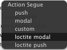

#Loctite

How many times did you ear about what pain is work with `storyboards` in team because it kill your SCM?

How much time did you spend loading big storyboard files in your slow machine?


`Loctite` arrives to help you to split your `Main.storyboard` unique file in several sub-storyboards, and acts as glue (Loctite's name comes from here ;)) to connect them.

And all of that without write any line of code!!!


## Install

`Loctite` is available via Cocoa Pods, so you only need to include this line in your Podfile

```
pod 'Loctite'
```

## Use

After install pod in your project, you only need to generate a dummy view controller on your storyboard, and connect it with a segue (rigth button and drag over it). A dialog as follows will appear, and you can choose between `loctite push` or `loctite modal` depending which transition you like.



After that, you only need to set segue identifier to `[storyboard_file].[viewcontroller_identifier]`, for example, if you have another storyboard named `Second.storyboard`, you should set segue identifier to `Second.recursiveVC`, and it'll fired `recursiveVC` view controller from this separated file. Easy, isn't it?

Anyway, my recomendation is to inspect __Demo project__ to see examples.

## Author
- Jorge Maroto ([@patoroco](http://twitter.com/patoroco)).

## License
`Modaly` is available under the MIT license. See the [LICENSE file](LICENSE.md) for more info.